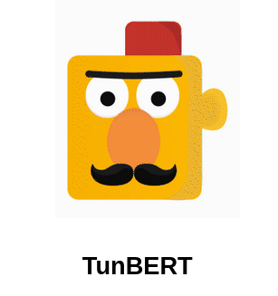

# What is TunBERT?

<p align="center">
  
</p>


People in Tunisia use the Tunisian dialect in their daily communications, in most of their media (TV, radio, songs, etc), and on the internet (social media, forums). Yet, this dialect is not standardized which means there is no unique way for writing and speaking it. Added to that, it has its proper lexicon, phonetics, and morphological structures. The need for a robust language model for the Tunisian dialect has become crucial in order to develop NLP-based applications (translation, information retrieval, sentiment analysis, etc).

BERT (Bidirectional Encoder Representations from Transformers) is a method to pre-train general purpose natural language models in an unsupervised fashion and then fine-tune them on specific downstream tasks with labelled datasets. This method was first implemented by Google and gives state-of-the-art results on many tasks as it's the first deeply bidirectional NLP pre-training system. 

TunBERT is the first release of a pre-trained BERT model for the Tunisian dialect using a Tunisian Common-Crawl-based dataset. TunBERT was applied to three NLP downstream tasks: Sentiment Analysis (SA), Tunisian Dialect Identification (TDI) and  Reading Comprehension Question-Answering (RCQA).


# What has been released in this repository?
This repository includes the code for fine-tuning TunBERT on the three downstream tasks: Sentiment Analysis (SA), Tunisian Dialect Identification (TDI) and  Reading Comprehension Question-Answering (RCQA). This will help the community reproduce our work and collaborate continuously.
We also released the two pre-trained new models: TunBERT Pytorch and TunBERT TensorFlow.
Finally, we open source the fine-tuning datasets used for Tunisian Dialect Identification (TDI)  and  Reading Comprehension Question-Answering (RCQA)

# About the Pre-trained models
TunBERT Pytorch model is based on BERT’s Pytorch implementation from [NVIDIA NeMo](https://github.com/NVIDIA/NeMo). The model was pre-trained using 4 NVIDIA Tesla V100 GPUs on a dataset of 500k Tunisian social media comments written in Arabic letters. The pretrained model consists of 12 layers of self-attention modules. Each module is made with 12 heads of self-attention with 768 hidden-size.  Furthermore, an Adam optimizer was used, with a learning rate of 1e-4, a batch size of 128, a maximum sequence length of 128 and a masking probability of 15%. Cosine annealing was used for a learning rate scheduling with a warm-up ratio of 0.01.

Similarly, a second TunBERT TensorFlow model was trained using TensorFlow implementation from [Google](https://github.com/google-research/bert). We use the same compute power for pre-training this model (4 NVIDIA Tesla V100 GPUs) while keeping the same hyper-parameters: A learning rate of 1e-4, a batch size of 128 and a maximum sequence length of 128.

The two models are available for download through:

For TunBERT PyTorch:

* [PretrainingBERTFromText--end.ckpt](https://storage.googleapis.com/tunbert-opensource-datasets/PyTorch_model/PretrainingBERTFromText--end.ckpt)

For TunBERT TensorFlow:

* [TunBERT_config.json](https://storage.googleapis.com/tunbert-opensource-datasets/TensorFlow_model/bert_config.json)

* [vocab.txt](https://storage.googleapis.com/tunbert-opensource-datasets/TensorFlow_model/vocab.txt)

* [TunBERT.ckpt.data-00000-of-00001.index](https://storage.googleapis.com/tunbert-opensource-datasets/TensorFlow_model/bert_model_step_616000.ckpt-154.data-00000-of-00001.index)

* [TunBERT.ckpt.data-00000-of-00001](https://storage.googleapis.com/tunbert-opensource-datasets/TensorFlow_model/bert_model_step_616000.ckpt-154.data-00000-of-00001)


# About the Finetuning datasets
## Tunisian Sentiment Analysis
* Tunisian Sentiment Analysis Corpus (TSAC) obtained from Facebook comments about popular TV shows. The TSAC dataset contains both Arabic and latin characters. Hence, we used only Arabic comments.

Dataset link: [TSAC](https://github.com/fbougares/TSAC)

Reference : Salima Medhaffar, Fethi Bougares, Yannick Estève and Lamia Hadrich-Belguith. Sentiment analysis of Tunisian dialects: Linguistic Resources and Experiments. WANLP 2017. EACL 2017

* Tunisian Election Corpus (TEC) obtained from tweets about Tunisian elections in 2014.

Dataset link: [TEC](https://karimsayadi.github.io/research/articles/acling16.pdf)

Reference: Karim Sayadi, Marcus Liwicki, Rolf Ingold, Marc Bui. Tunisian Dialect and Modern Standard Arabic Dataset for Sentiment Analysis : Tunisian Election Context, IEEE-CICLing (Computational Linguistics and Intelligent Text Processing) Intl. conference, Konya, Turkey, 7-8 Avril 2016.


## Tunisian Dialect Identification
Tunisian Arabic Dialects Identification(TADI): It is a binary classification task consisting of classifying Tunisian dialect and Non Tunisian dialect from an Arabic dialectical dataset.

Tunisian Algerian Dialect(TAD): It is a binary classification task consisting of classifying Tunisian dialect and Algerian dialect from an Arabic dialectical dataset.

The two datasets are available for download for research purposes:

TADI:
* [Train-set](https://storage.googleapis.com/tunbert-opensource-datasets/TADI_dataset/TADI_train.tsv)
* [Valid-set](https://storage.googleapis.com/tunbert-opensource-datasets/TADI_dataset/TADI_valid.tsv)
* [Test-set](https://storage.googleapis.com/tunbert-opensource-datasets/TADI_dataset/TADI_test.tsv)

TAD:
* [Train-set](https://storage.googleapis.com/tunbert-opensource-datasets/TAD_dataset/TAD_train.tsv)
* [Valid-set](https://storage.googleapis.com/tunbert-opensource-datasets/TAD_dataset/TAD_valid.tsv)
* [Test-set](https://storage.googleapis.com/tunbert-opensource-datasets/TAD_dataset/TAD_test.tsv)

## Reading Comprehension Question-Answering
For this task, we built TRCD (Tunisian Reading Comprehension Dataset) as a Question-Answering dataset for Tunisian dialect. We used a dialectal version of the Tunisian constitution following the guideline in [this article](https://arxiv.org/abs/1704.00051). It is composed of 144 documents where each document has exactly 3 paragraphs and three Question-Answer pairs are assigned to each paragraph. Questions were formulated by four Tunisian native speaker annotators and each question should be paired with a paragraph.

We made the dataset publicly available for research purposes:

TRCD:
* [Train-Set](https://storage.googleapis.com/tunbert-opensource-datasets/TRCD_dataset/TRCD_train.json)
* [Valid-Set](https://storage.googleapis.com/tunbert-opensource-datasets/TRCD_dataset/TRCD_valid.json)
* [Test-Set](https://storage.googleapis.com/tunbert-opensource-datasets/TRCD_dataset/TRCD_test.json)


# Install
We use:
* `conda` to setup our environment,
* and python 3.7.9

**Setup our environment**:

```shell script
# Clone the repo
git clone https://github.com/instadeepai/tunbert.git
cd tunbert

# Create a conda env
conda env create -f environment_torch.yml #bert-nvidia
conda env create -f environment_tf2.yml #bert-google

# Activate conda env
conda activate tunbert-torch #bert-nvidia
conda activate tf2-google #bert-google

# Install pre-commit hooks
pre-commit install

# Run all pre-commit checks (without committing anything)
pre-commit run --all-files
```

# Project Structure

This is the folder structure of the project:
```
README.md             # This file :)
.gitlab-ci.yml        # CI with gitlab
.gitlab/              # Gitlab specific 
.pre-commit-config.yml  # The checks to run before every commit
environment_torch.yml       # contains the conda environment definition 
environment_tf2.yml       # contains the conda environment definition for pre-training bert-google
...

dev-data/             # data sample
    sentiment_analysis_tsac/
    dialect_classification_tadi/
    question_answering_trcd/

models/               # contains the different models to used 
    bert-google/
    bert-nvidia/

```

# TunBERT-PyTorch

## Fine-tune TunBERT-PyTorch on the Sentiment Analysis (SA) task
To fine-tune TunBERT-PyTorch on the SA task, you need to:
* Run the following command-line:
```
python models/bert-nvidia/bert_finetuning_SA_DC.py --config-name "sentiment_analysis_config" model.language_model.lm_checkpoint="/path/to/checkpoints/PretrainingBERTFromText--end.ckpt" model.train_ds.file_path="/path/to/train.tsv" model.validation_ds.file_path="/path/to/valid.tsv" model.test_ds.file_path="/path/to/test.tsv"
```

## Fine-tune TunBERT-PyTorch on the Dialect Classification (DC) task
To fine-tune TunBERT-PyTorch on the DC task, you need to:
* Run the following command-line:
```
python models/bert-nvidia/bert_finetuning_SA_DC.py --config-name "dialect_classification_config" model.language_model.lm_checkpoint="/path/to/checkpoints/PretrainingBERTFromText--end.ckpt" model.train_ds.file_path="/path/to/train.tsv" model.validation_ds.file_path="/path/to/valid.tsv" model.test_ds.file_path="/path/to/test.tsv"
```

## Fine-tune TunBERT-PyTorch on the Question Answering (QA) task
To fine-tune TunBERT-PyTorch on the QA task, you need to:
* Run the following command-line:
```
python models/bert-nvidia/bert_finetuning_QA.py --config-name "question_answering_config" model.language_model.lm_checkpoint="/path/to/checkpoints/PretrainingBERTFromText--end.ckpt" model.train_ds.file="/path/to/train.json" model.validation_ds.file="/path/to/val.json" model.test_ds.file="/path/to/test.json"
```

# TunBERT-TensorFlow

## Fine-tune TunBERT-TensorFlow on the Sentiment Analysis (SA) or Dialect Classification (DC) Task:
To fine-tune TunBERT-TensorFlow for a SA task or, you need to:
* Specify the **BERT_FOLDER_NAME** in ```models/bert-google/finetuning_sa_tdid.sh```. 

	**BERT_FOLDER_NAME** should contain the config and vocab files and the checkpoint of your language model 
* Specify the **DATA_FOLDER_NAME** in ```models/bert-google/finetuning_sa_tdid.sh```
* Run:
```
bash models/bert-google/finetuning_sa_tdid.sh
```
## Fine-tune TunBERT-TensorFlow on the Question Answering (QA) Task:
To fine-tune TunBERT-TensorFlow for a QA task, you need to:
* Specify the **BERT_FOLDER_NAME** in ```models/bert-google/finetuning_squad.sh```. 

    **BERT_FOLDER_NAME** should contain the config and vocab files and the checkpoint of your language model 
* Specify the **DATA_FOLDER_NAME** in ```models/bert-google/finetuning_squad.sh```
* Run:
```
bash models/bert-google/finetuning_squad.sh
```
You can view the results, by launching tensorboard from your logging directory.

e.g. `tensorboard --logdir=OUTPUT_<task>_FOLDER_NAME`
# Contact information
InstaDeep

* Website: https://instadeep.com

* Twitter: @instadeepai

* Email: hello@instadeep.com


iCompass

* Website: https://www.icompass.tn/

* Twitter: @iCompass_

* Email: team@icompass.digital
